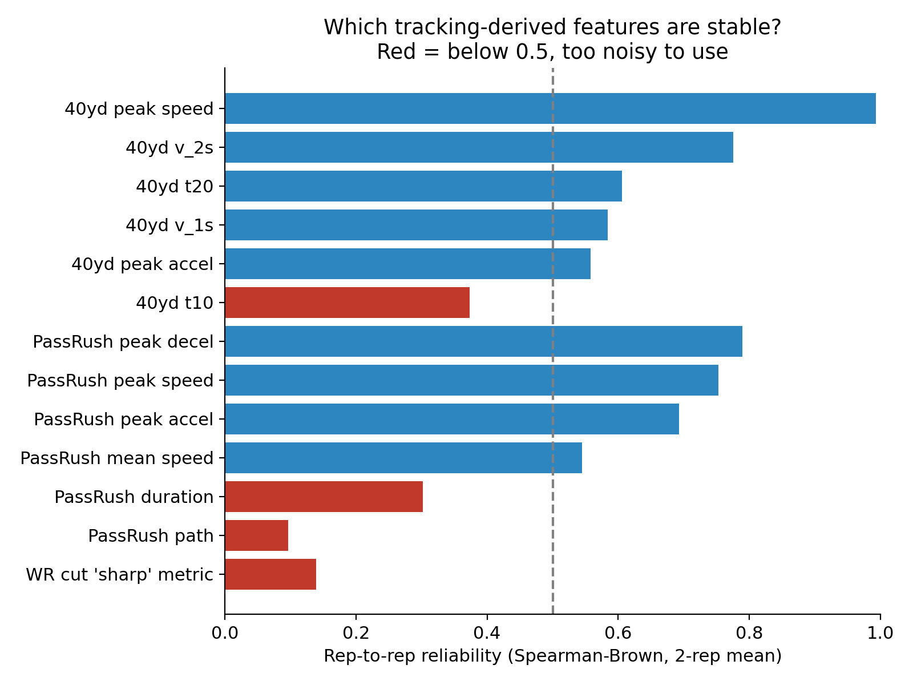
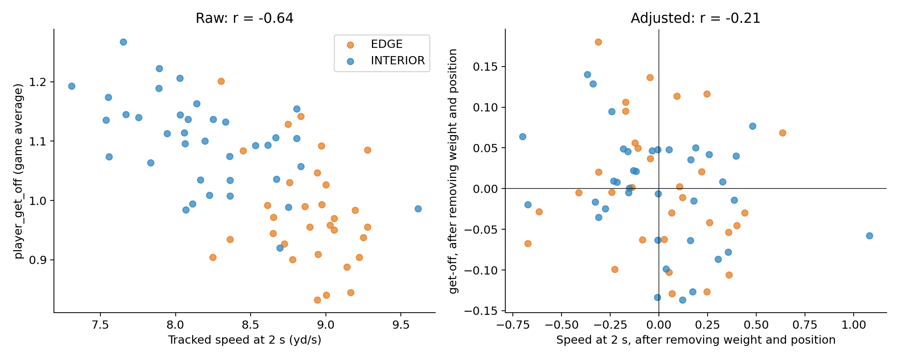
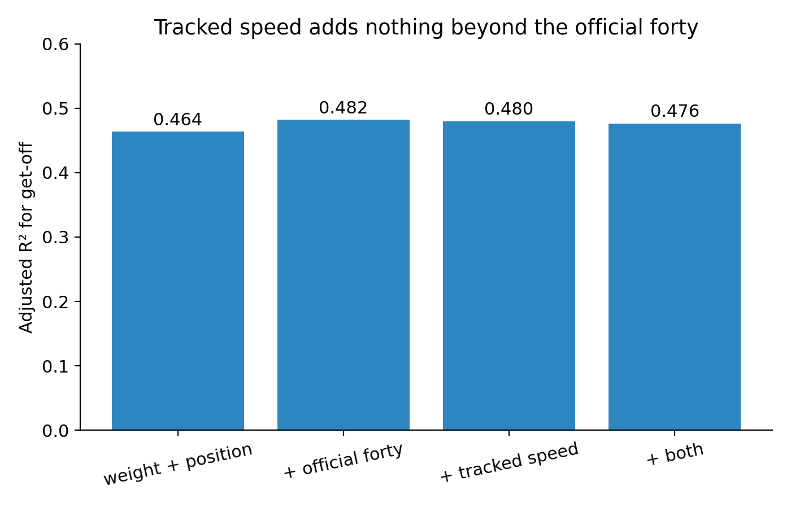
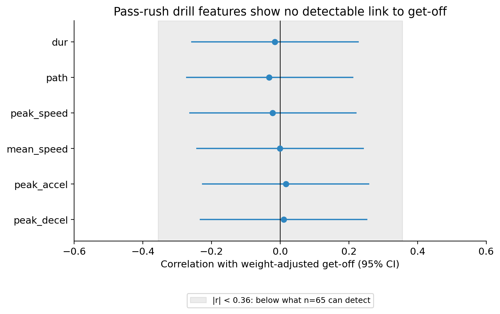

# Does Combine Tracking Add Anything Beyond the Stopwatch?

A reliability audit with defensive-line get-off as the test case. Built for the **NFL Big Data Bowl 2027** on Kaggle (Open Track).

- Kaggle notebook: https://www.kaggle.com/code/faithamanze/nfl-big-data-bowl-2027-does-combine-tracking-add

## Question
Combine drills now come with 10 Hz sensor tracking. Which tracking-derived features are stable enough to trust, and do they predict NFL performance beyond weight, position and the official drill times?

## Main findings
- Tracked peak speed is almost a copy of the official forty (r = -0.98).
- Of 13 tracking features audited, 4 were too noisy to use (reliability below 0.5).
- Among 68 defensive linemen (regular-season plays only), weight and position explain about half of get-off (adjusted R-squared 0.464).
- Tracked speed adds nothing detectable beyond the official forty (F-test p = 0.61).
- Reliable pass-rush drill features show no detectable link to weight-adjusted get-off (n = 65; correlations between -0.03 and 0.02).
- The sample can only detect correlations of about 0.36 or larger, so small effects are not ruled out.

## Figures

## Method in brief
Resample each drill rep to a 10 Hz grid, build speed-profile features, check rep-to-rep reliability (Spearman-Brown), then test whether tracked speed adds anything to weight, position and the forty in an OLS model of get-off. Decision rules were set before looking at outcomes; abandoned ideas are disclosed in the writeup.

## Running it
The notebook is written for Kaggle and reads the data from the /kaggle/input/... path set in the variable R near the top. To run it elsewhere, download the data from the competition page and change R. Required packages: pandas, numpy, matplotlib, statsmodels, scipy.

## Data
The competition data is not included here. Get it from the NFL Big Data Bowl 2027 competition page on Kaggle (CC BY-NC 4.0).